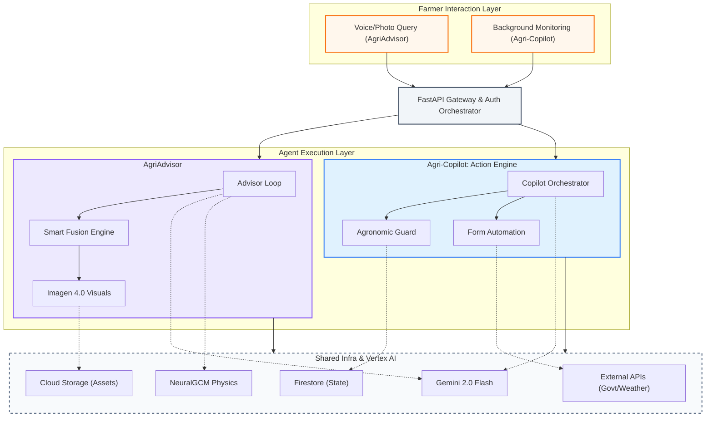

# SmartAgri System Architecture: Foundational Layout

This diagram illustrates the dual-track operation of the **AgriAdvisor** and **Agri-Copilot**, built upon a unified **Shared Infrastructure** foundation.

### Strategic Layout
1.  **Entry Layer**: Captures both active (voice) and passive (background) triggers.
2.  **FastAPI Gateway**: The central dispatcher for the entire ecosystem.
3.  **Agent Execution Layer**: Where the **AgriAdvisor** (Reasoning) and **Agri-Copilot** (Action) operate in parallel.
4.  **Foundation Layer**: The "bedrock" of the system, housing the **Vertex AI Models** and **Cloud Infrastructure** that both agents rely on for intelligence and persistence.
